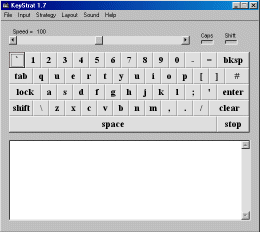



## A keyboard emulator called KeyStrat 1\.7

### Description

KeyStrat 1.7 is a fully working Keyboard Emulator. It includes many features such as different keyboard layouts and different key selection strategies. If anyone wants to develop the emulator further all that I ask is that you keep the KeyStrat name and mention me as the originator. (Requires VB6 Runtime library). Please take the time to vote / add your feedback, thanks!
 
### More Info
 

             |
---                |---
**Submitted On**   |2000-03-06 18:52:36
**By**             |[Paul Long](https://github.com/Planet-Source-Code/PSCIndex/blob/master/ByAuthor/paul-long.md)
**Level**          |Beginner
**User Rating**    |5.0 (20 globes from 4 users)
**Compatibility**  |VB 5\.0, VB 6\.0
**Category**       |[Miscellaneous](https://github.com/Planet-Source-Code/PSCIndex/blob/master/ByCategory/miscellaneous__1-1.md)
**World**          |[Visual Basic](https://github.com/Planet-Source-Code/PSCIndex/blob/master/ByWorld/visual-basic.md)
**Archive File**   |[CODE\_UPLOAD6386632000\.zip](https://github.com/Planet-Source-Code/paul-long-a-keyboard-emulator-called-keystrat-1-7__1-8598/archive/master.zip)

